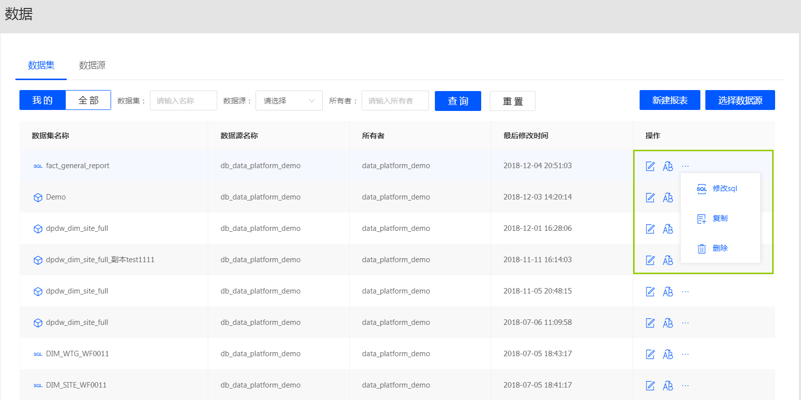
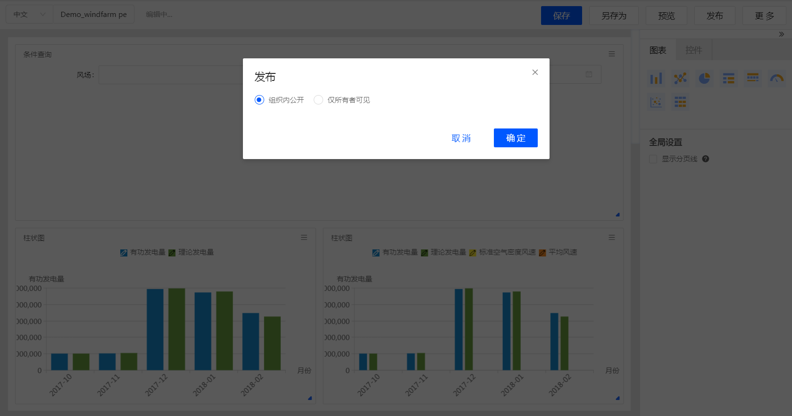

# 最佳实践

## 如何直接使用组织内其他用户创建的数据集？

同一个组织的用户，共享同一个Report DB，即数据面向组织内所有用户可见。创建报表时，若需要使用其他用户已编辑好的数据集，可以在**全部数据集**中复制组织内其他用户创建的数据集。

选择其他用户创建的数据集，点击**复制**，会在**我的数据集**中创建数据集的副本。接下来，就可以对数据集副本进行编辑、重命名等操作。

## 发布报表时，选择**所有者可见**还是**组织内公开**？

报表编辑完成后，可以将当前报表发布为**仅所有者可见**或**组织内公开**。发布成功后，用户将获取一个URL地址。在浏览器中输入该URL地址，并输入用户名及登录密码。验证成功后，就可以在线查看报表内容，而不需要登录EnOS控制台，进入BI & Report中查看报表。

若报表需要面向组织内所有用户展示，可以选择**组织内公开**。此时，组织内其他用户也可以在线查看报表内容。若不需要面向组织内其他用户展示，可以选择**仅所有者可见**。此时，仅创建者可以访问报表内容。

对于已发布的报表，可以在报表列表中直接点击该报表的名称，在线查看报表。另外，对于发布为**组织内公开**的报表，可以在**报表列表->全部**中查看。

发布报表有两种途径：

- 报表列表页面，选择一个报表，点击右侧的****按钮，在展开菜单中，点击**发布**并**确定**
- 报表编辑页面，点击右上角的**发布**按钮并**确认**

