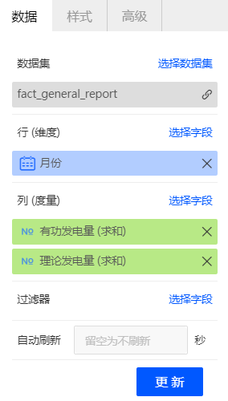
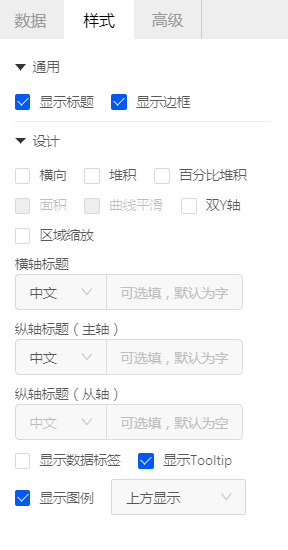
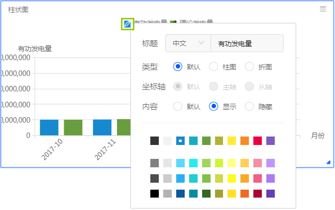

# 柱图

柱图常用来显示一段时间内的数据变化或显示各项之间的比较情况，比如不同风场的年发电量对比。

## 任务描述

柱图需要选择1个维度，1个或多个度量。

创建报表之前，需要先准备数据集。假设已经完成数据集创建，下面介绍柱图的使用方法。

1. 登录**控制台**，选择**BI & Report**，然后选择**报表**。点击**新建报表**，进入报表编辑页面。

2. 双击**柱图**图标，柱图的图例会自动显示在报表展示区。

3. 在数据标签中，点击**选择数据集**，在下拉列表中选择目标数据集。

4. 点击**选择字段**，下拉列表中将展示所选数据集的全部维度及度量字段。

5. 在下拉列表中，选择行（维度）及列（度量）字段。

6. 点击**更新**，系统自动更新图表。

   **注意**：配置图表的数据时，只有点击**更新**，数据配置才会生效。

7. 若需要设置过滤器，请参考[设置过滤器](filter)使用说明。

8. 在**自动刷新**一栏中，输入数据自动刷新的频率。支持的最小值为5秒。

   

9. 完成数据配置后，可以选择样式标签，设置柱图的样式。包括通用及设计两类。样式设置实时生效，具体说明如下:

   - 是否显示标题

   - 是否显示边框

   - 选择柱图的显示效果，包括横向、堆积，百分比堆积，双Y轴及区域缩放

     **注意**：当且仅当度量字段不少于2个时，可以设置堆积、百分比堆积及双Y轴。若度量字段仅为1个，仅支持横向。

   - 设置横轴、纵轴（主轴）及纵轴（从轴）的标题，支持中文、英文及特殊字符，且不超过50个字符

   - 是否显示数据标签

   - 是否显示Tooltip

   - 设置显示图例的位置，支持上方、下方、左侧、右侧显示

     

10. 完成样式配置后，可以选择高级标签，配置多图关联。具体使用方法，请参考**多图关联**的使用说明。

11. 在报表展示区，选择柱图的图例，可以设置所选度量字段的显示效果。包括标题、类型、坐标轴、内容及颜色。具体说明如下：

    - 标题，支持中文、英文及特殊字符，且不超过50个字符

    - 类型，若将所选度量字段设置为线图，可以实现柱折混合图的效果

    - 坐标轴，在样式中选择双Y轴后，可以设置某个度量字段为从轴

    - 内容，显示或者隐藏所选度量字段

    - 颜色，设置所选度量字段的显示颜色

      

12. 若需要查看图表对应的数据，并将数据下载到本地，或删除所选图表。需要先选中图表，然后点击标题栏右上角的。在下拉菜单中选择**查看数据**并**下载**到本地。或者选择**删除**，删除所选图表。

13. 配置完成后，点击工具栏中的**保存**。
