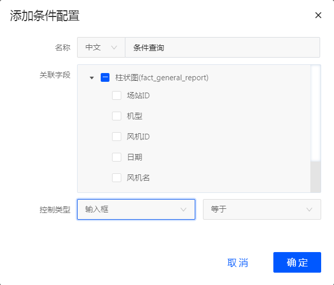
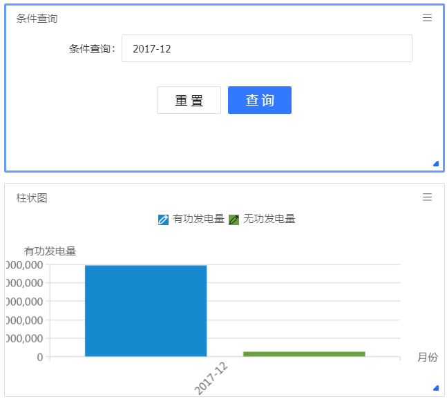
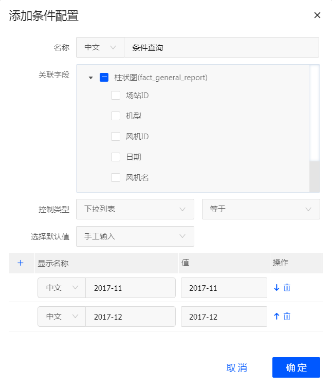
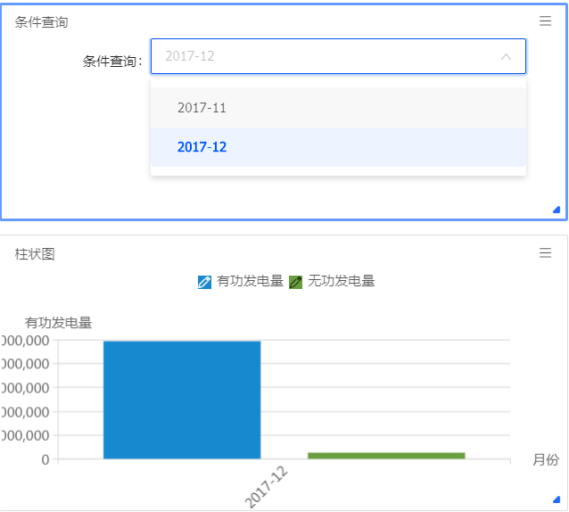
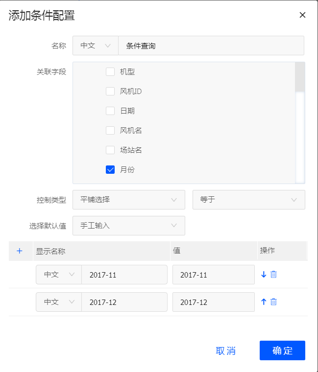
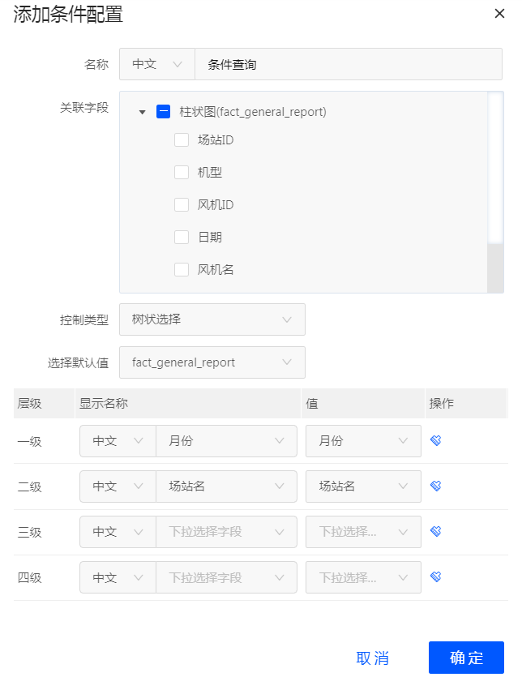
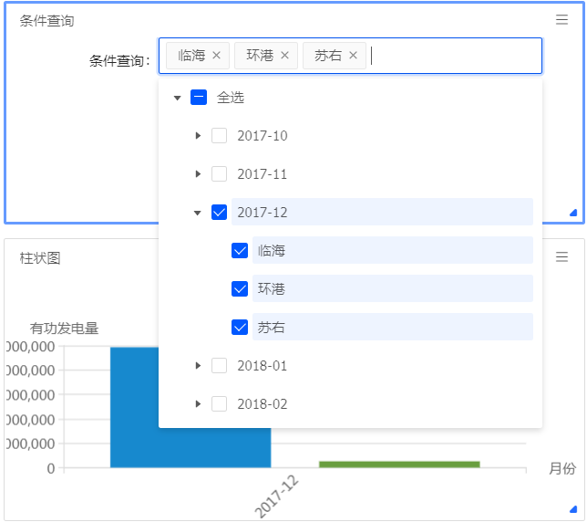
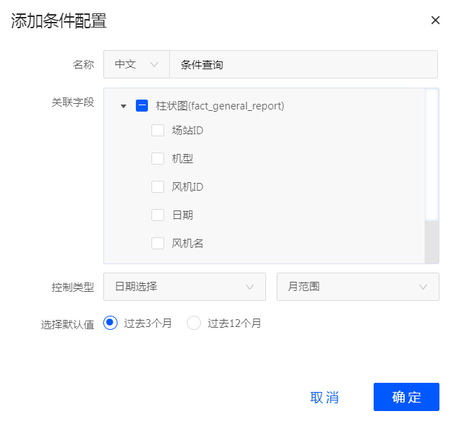
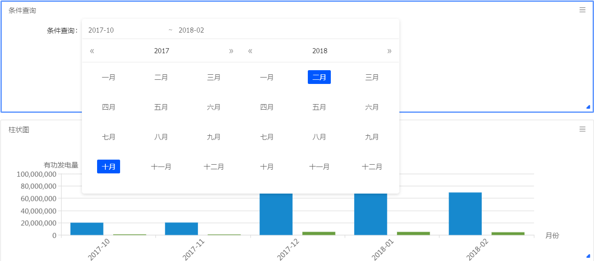

# 条件查询

制作报表时，可以配置条件查询控件，来查询1个或多个图表的数据。

当前支持输入框、下拉选择、日期选择、树状选择及平铺选择，具体的过滤条件说明如下：

<table>
  <tr>
    <td>控件类型</td>
    <td>过滤条件</td>
  </tr>
  <tr>
    <td>输入框</td>
    <td>等于、不等于、大于、大于等于、小于、小于等于、介于、模糊匹配、模糊不匹配</td>
  </tr>
  <tr>
    <td>下拉选择</td>
    <td>等于、介于</td>
  </tr>
  <tr>
    <td>平铺选择</td>
    <td>等于、介于</td>
  </tr>
  <tr>
    <td>树状选择</td>
    <td>介于</td>
  </tr>
  <tr>
    <td>日期选择</td>
    <td>日范围、周范围、月范围、年范围</td>
  </tr>
</table>

下面以柱图为例，说明条件查询控件的使用方式。

## 前置条件

创建报表，至少添加1个图表，并完成数据配置。

## 基本概念

关联字段：在配置条件查询控件时，需要选择图表的关联字段（维度字段）。输入的查询条件将作为过滤条件，过滤被关联图表中维度值等于过滤值的数据。在本例中，当选择柱图中的某个维度值作为关联字段，输入查询条件后，将筛选柱图的数据。

## 输入框

1. 登录**控制台**，选择**BI & Report**，然后选择**报表**。点击**新建报表**，进入报表编辑页面。

2. 双击柱图图标，柱图的图例会自动显示在报表展示区。在数据标签页，完成数据配置。

3. 在控件标签下双击**条件查询**图标，条件查询控件的图例会自动显示在报表展示区。

4. 在条件配置标签中，点击**添加条件查询**，在弹框中配置查询条件。

5. 输入名称，必填，支持中文，英文及特殊字符，不超过50个字符。

6. 选择**关联字段**，通常情况下，每个图表仅选择一个维度字段。

7. 在控件类型下拉列表中选择**输入框**，在过滤条件下拉列表中选择**等于**。

8. 点击**确定**，完成过滤条件配置。

     

9. 在条件查询控件中输入过滤条件，点击**查询**，被关联的柱图将按查询条件过滤数据。

10. 选中条件查询"控件，在条件配置标签下，可以**编辑，删除，显示或隐藏条件**，以及继续**添加条件配置**。

      

11. 条件配置完成后，可以选择样式标签，设置条件查询的样式。样式设置实时生效，具体说明如下:

    - 是否显示标题

    - 是否显示边框

       

12. 若需要删除所选控件。需要先选中控件，然后点击标题栏右上角的"。在下拉菜单中选择**删除**，删除所选控件。

13. 配置完成后，点击工具栏中的**保存**。

## 下拉选择

1. 登录**控制台**，选择**BI & Report**，然后选择**报表**。点击**新建报表**，进入报表编辑页面。

2. 双击柱图图标，柱图的图例会自动显示在报表展示区。在数据标签页，完成数据配置。

3. 在控件标签下双击**条件查询**图标，条件查询控件的图例会自动显示在报表展示区。

4. 在条件配置标签中，点击**添加条件查询**，在弹框中配置查询条件。

5. 输入名称，必填，支持中文，英文及特殊字符，不超过50个字符。

6. 选择**关联字段**，通常情况下，每个图表仅选择一个维度字段。

7. 在控件类型下拉列表中选择**下拉选择**，在过滤条件下拉列表中选择**等于**。

8. 在选择默认值中选择**手工输入**，然后在下方的条件配置中，配置查询条件。

9. 添加**显示名称**，必填，支持中文，英文及特殊字符，不超过50个字符。

10. 添加**值**，必填。此处值将作为实际的过滤条件，筛选关联图表的数据。

11. 点击**+**，添加新的条件，点击箭头调整条件先后顺序，点击删除，删除所选条件。

12. 点击**确定**，完成过滤条件配置。

     

13. 在条件查询控件中选择过滤条件，点击**查询**，被关联的柱图将按查询条件过滤数据。

14. 选中条件查询"控件，在条件配置标签下，可以**编辑，删除，显示或隐藏条件**，以及继续**添加条件配置**。

     

15. 条件配置完成后，可以选择样式标签，设置条件查询的样式。样式设置实时生效，具体说明如下:

    - 是否显示标题

    - 是否显示边框

       

16. 若需要删除所选控件。需要先选中控件，然后点击标题栏右上角的"。在下拉菜单中选择**删除**，删除所选控件。

17. 配置完成后，点击工具栏中的**保存**。

当选择默认值下拉列表中选择维表时，需要先选择数据集。然后在所选数据集中选择下拉选择的**显示名称**字段，以及对应的**值**字段。通常，显示名称字段和值字段是同一个字段。

## 平铺选择

1. 登录**控制台**，选择**BI & Report**，然后选择**报表**。点击**新建报表**，进入报表编辑页面。

2. 双击柱图图标，柱图的图例会自动显示在报表展示区。在数据标签页，完成数据配置。

3. 在控件标签下双击**条件查询**图标，条件查询控件的图例会自动显示在报表展示区。

4. 在条件配置标签中，点击**添加条件查询**，在弹框中配置查询条件。

5. 输入名称，必填，支持中文，英文及特殊字符，不超过50个字符。

6. 选择**关联字段**，通常情况下，每个图表仅选择一个维度字段。

7. 在控件类型下拉列表中选择**平铺选择**，在过滤条件下拉列表中选择**等于**。

8. 在选择默认值中选择**手工输入**，然后在下方的条件配置中，配置查询条件。

9. 添加**显示名称**，必填，支持中文，英文及特殊字符，不超过50个字符。

10. 添加**值**，必填。此处值将作为实际的过滤条件，筛选关联图表的数据。

11. 点击**+**，添加新的条件，点击箭头调整条件先后顺序，点击删除，删除所选条件。

12. 点击**确定**，完成过滤条件配置。

     

13. 在条件查询控件中选择过滤条件，点击**查询**，被关联的柱图将按查询条件过滤数据。

14. 选中条件查询"控件，在条件配置标签下，可以**编辑，删除，显示或隐藏条件**，以及继续**添加条件配置**。

     

15. 条件配置完成后，可以选择样式标签，设置条件查询的样式。样式设置实时生效，具体说明如下:

    - 是否显示标题

    - 是否显示边框

       

16. 若需要删除所选控件。需要先选中控件，然后点击标题栏右上角的"。在下拉菜单中选择**删除**，删除所选控件。

17. 配置完成后，点击工具栏中的**保存**。

当选择默认值下拉列表中选择维表时，需要先选择数据集。然后在所选数据集中选择下拉选择的**显示名称**字段，以及对应的**值**字段。通常，显示名称字段和值字段是同一个字段。

## 树状选择

1. 登录**控制台**，选择**BI & Report**，然后选择**报表**。点击**新建报表**，进入报表编辑页面。

2. 双击柱图图标，柱图的图例会自动显示在报表展示区。在数据标签页，完成数据配置。

3. 在控件标签下双击**条件查询**图标，条件查询控件的图例会自动显示在报表展示区。

4. 在条件配置标签中，点击**添加条件查询**，在弹框中配置查询条件。

5. 输入名称，必填，支持中文，英文及特殊字符，不超过50个字符。

6. 选择**关联字段**，通常情况下，每个图表仅选择一个维度字段。

7. 在控件类型下拉列表中选择**树状选择**。

8. 在选择默认值中选择数据集，然后在下方的条件配置中，配置查询条件，且最多支持**4层**树状结构。

9. 添加**显示名称**，在下拉列表中选择显示名称字段。

10. 添加**值**，在下拉列表中选择值字段。通常，显示名称字段和值字段是同一个字段。

11. 点击,清除字段配置信息。

12. 点击**确定**，完成过滤条件配置。

     

13. 在条件查询控件中选择过滤条件，点击**查询**，被关联的柱图将按查询条件过滤数据。

14. 选中条件查询"控件，在条件配置标签下，可以**编辑，删除，显示或隐藏条件**，以及继续**添加条件配置**。

     

15. 条件配置完成后，可以选择样式标签，设置条件查询的样式。样式设置实时生效，具体说明如下:

    - 是否显示标题

    - 是否显示边框

       

16. 若需要删除所选控件。需要先选中控件，然后点击标题栏右上角的"。在下拉菜单中选择**删除**，删除所选控件。

17. 配置完成后，点击工具栏中的**保存**。

## 日期选择

1. 登录**控制台**，选择**BI & Report**，然后选择**报表**。点击**新建报表**，进入报表编辑页面。

2. 双击柱图图标，柱图的图例会自动显示在报表展示区。在数据标签页，完成数据配置。

3. 在控件标签下双击**条件查询**图标，条件查询控件的图例会自动显示在报表展示区。

4. 在条件配置标签中，点击**添加条件查询**，在弹框中配置查询条件。

5. 输入名称，必填，支持中文，英文及特殊字符，不超过50个字符。

6. 选择**关联字段**，通常情况下，每个图表仅选择一个维度字段。

7. 在控件类型下拉列表中选择**日期选择**，在过滤条件下拉列表中选择**月范围**。

8. 在选择默认值中，选择**过去3个月**。

9. 点击**确定**，完成过滤条件配置。

    

10. 在条件查询控件中选择过滤条件，点击**查询**，被关联的柱图将按查询条件过滤数据。

11. 选中条件查询"控件，在条件配置标签下，可以**编辑，删除，显示或隐藏条件**，以及继续**添加条件配置**。

     

12. 条件配置完成后，可以选择样式标签，设置条件查询的样式。样式设置实时生效，具体说明如下:

    - 是否显示标题

    - 是否显示边框

       

13. 若需要删除所选控件。需要先选中控件，然后点击标题栏右上角的"。在下拉菜单中选择**删除**，删除所选控件。

14. 配置完成后，点击工具栏中的**保存**。

> 请注意，选择日期选择的条件查询控件时，关联图表的维度字段，其数据类型必须为日期类，如DATA，DATATIME，TIMESTAMP，TIME，YEAR等。
