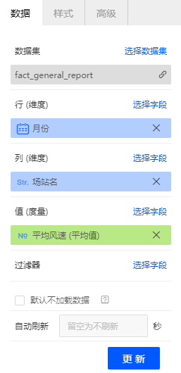
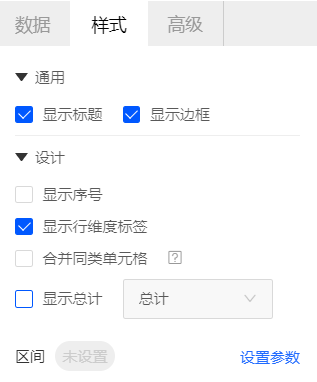
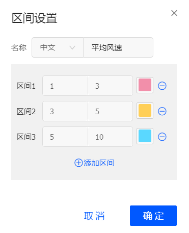
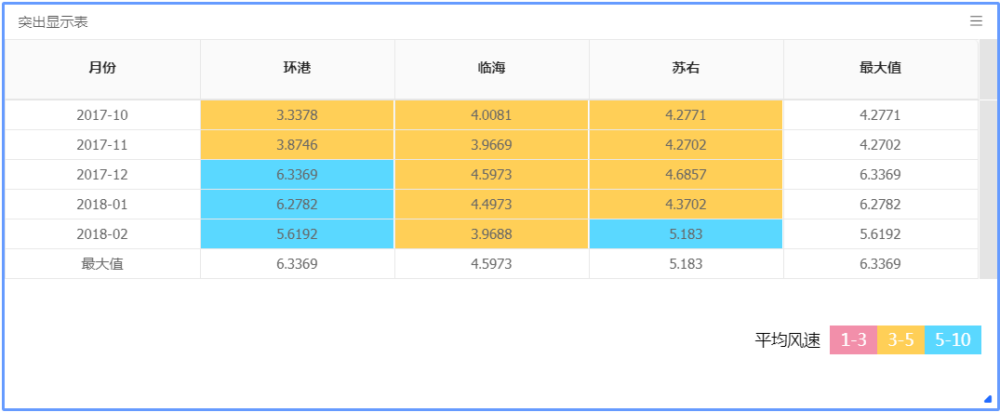

# 突出显示表

突出显示表由行维度、列维度及度量值构成，可以从不同维度查看同一个数据的表现。比如从场站、日期的角度，查看各场站每月的平均风速情况。同时，可以设置不同的区间及颜色，来显示数据大小的差异。

## 任务描述

**突出显示表需要选择2个或多个维度，1个度量**。特别地，突出显示表不支持多图关联的高级配置。

创建报表之前，需要先准备数据集。假设已经完成数据集创建，下面介绍突出显示表的使用方法。

1. 登录**控制台**，选择**BI & Report**，然后选择**报表**。点击**新建报表**，进入报表编辑页面。

2. 双击**突出显示表**图标，突出显示表的图例会自动显示在报表展示区。

3. 在数据标签中，点击**选择数据集**，在下拉列表中选择目标数据集。

4. 点击**选择字段**，下拉列表中将展示所选数据集的全部维度及度量字段。

5. 在下拉列表中，选择行（维度）、列（维度）及值（度量）字段。其中，行（维度）、列（维度）支持选择1个或多个，值（度量）仅可以选择1个。

6. 设置是否默认不加载数据。若选中默认不加载数据，点击更新按钮时，图表不加载数据。只有配置了非空的条件查询，点击查询，图表才会加载数据。若未选中，则点击更新按钮时，自动加载数据。

7. 点击**更新**，系统自动更新图表。

   > 请注意，配置图表的数据时，只有点击**更新**，数据配置才会生效。

8. 若需要设置过滤器，请参考**设置过滤器**使用说明。

9. 若需要设置自动刷新，请参考**自动刷新**使用说明。

   

10. 完成数据配置后，可以选择样式标签，设置突出显示表的样式。包括通用及设计两类。样式设置实时生效，具体说明如下:

  - 是否显示标题

  - 是否显示边框

  - 是否显示序号

  - 是否显示行维度标签

  - 是否合并同类单元格

  - 是否显示总计，包括四种聚合逻辑，分别是总计（求和）、平均值、最大值、最小值。选中显示总计后，将分别在表格的最后一行和最后一列，增加一列统计值，并分别按行或列聚合度量值。

  - 设置区间

    

11. 区间设置，通过设置不同的区间值，并分别选择不同的颜色，来突出显示度量值的大小。当度量值处在某个区间时，单元格的底色将显示为对应的颜色。

   - 填写区间名称，支持中文、英文及特殊字符，不超过50个字符

   - 点击**添加区间**，自动新增一个区间

   - 填写起始值及结束值，仅支持数字，且起始值必须小于结束值

   - 点击区间右侧的**减号**，删除所选区间

   - 点击区间右侧的**颜色块**，可以自定义区间颜色

   - 区间设置完成后，点击**确定**

     

12. 突出显示表不支持配置多图关联。

   

13. 若需要查看图表对应的数据，并将数据下载到本地，或删除所选图表。需要先选中图表，然后点击标题栏右上角的"。在下拉菜单中选择**查看数据**并**下载**到本地。或者选择**删除**，删除所选图表。

14. 配置完成后，点击工具栏中的**保存**。
