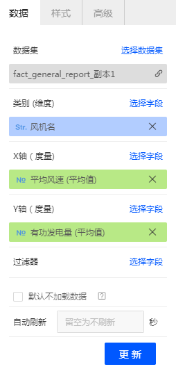
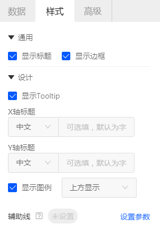
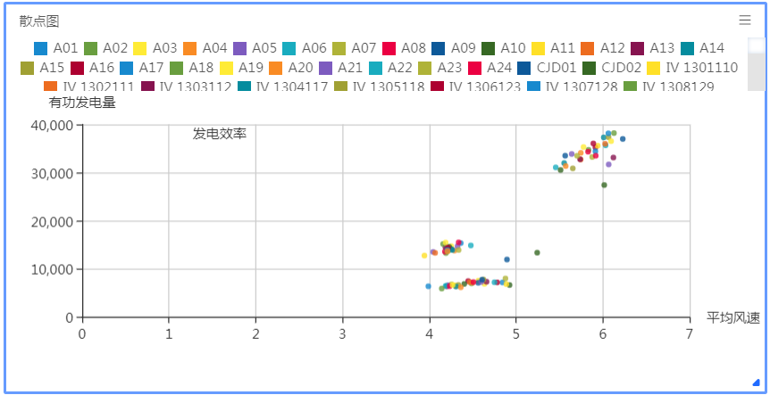

# 散点图

散点图可以用来展示数据的分布和聚合情况。

## 任务描述

**散点图需要选择1个或多个维度，2个度量**。

创建报表之前，需要先准备数据集。假设已经完成数据集创建，下面介绍散点图的使用方法。

1. 登录**控制台**，选择**BI & Report**，然后选择**报表**。点击**新建报表**，进入报表编辑页面。

2. 双击**散点图**图标，散点图的图例会自动显示在报表展示区。

3. 在数据标签中，点击**选择数据集**，在下拉列表中选择目标数据集。

4. 点击**选择字段**，下拉列表中将展示所选数据集的全部维度及度量字段。

5. 在下拉列表中，选择类别（维度）、X轴（度量）及Y轴（度量）字段。当选择至少2个维度字段时，度量值将以所有的维度字段作为聚合条件。但是，散点图的图例中将仅显示排在首位的维度字段。

6. 设置是否默认不加载数据。若选中默认不加载数据，点击更新按钮时，图表不加载数据。只有配置了非空的条件查询，点击查询，图表才会加载数据。若未选中，则点击更新按钮时，自动加载数据。

7. 点击**更新**，系统自动更新图表。

   > 请注意，配置图表的数据时，只有点击**更新**，数据配置才会生效。

8. 若需要设置过滤器，请参考[设置过滤器](filter)使用说明。

9. 在**自动刷新**一栏中，输入数据自动刷新的频率。支持的最小值为5秒。

   

10. 完成数据配置后，可以选择样式标签，设置散点图的样式。包括通用及设计两类。样式设置实时生效，具体说明如下:

  - 是否显示标题

  - 是否显示边框

  - 是否显示Tooltip

  - 设置X轴标题及Y轴标题，支持中文、英文及特殊字符，不超过50个字符

  - 设置显示图例的位置，支持上方、下方、左侧、右侧显示

  - 设置辅助线。散点图中添加适当的辅助线，可辅助分析数据。当前支持一次线性函数y=kx+b，其中y为因变量，x为自变量，k为斜率，b为截距。

    

11. 辅助线的参数设置分为手工输入及选择维表两种方式。以最常见的手工输入为例，介绍如何设置辅助线。当选择维表的方式时，需要提前准备好数据集，维表中的度量字段代表每条辅助线的斜率和截距。

   - 点击**添加辅助线**，自动新增一个辅助线
   - 填写辅助线名，选填，支持中文、英文及特殊字符，不超过50个字符
   - 填写斜率及截距，仅支持数字
   - 点击辅助线右侧的**减号**，删除所选辅助线
   - 辅助线设置完成后，点击**确定**

12. 完成样式配置后，可以选择高级标签，配置多图关联。具体使用方法，请参考**多图关联**的使用说明。

   

13. 若需要查看图表对应的数据，并将数据下载到本地，或删除所选图表。需要先选中图表，然后点击标题栏右上角的。在下拉菜单中选择**查看数据**并**下载**到本地。或者选择**删除**，删除所选图表。

14. 配置完成后，点击工具栏中的**保存**。
