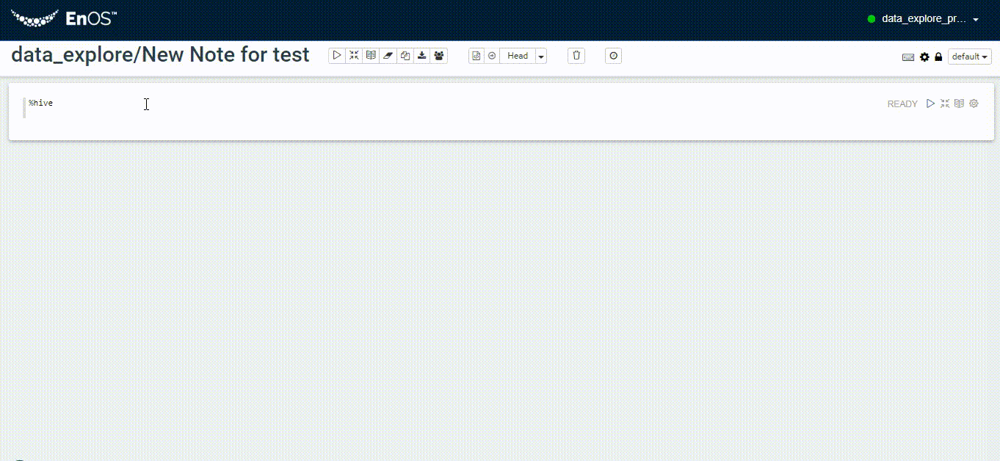

# Getting started with Data Explorer

A typical flow to use Data Explorer to explorer data is as follows:

## Step 1: Create a new note

1. Click **Data Explorer** from the left navigation panel of EnOS Console.
2.  Click **New note**.
3. In the **New Note** window, enter the name of the notebook and select the note type.
4. Click  to enter the note and begin your work.

  

## Step 2: Program and run your codes with interpreter

To invoke an interpreter, enter `%<interpreter_name>` (percent). The following table lists the supported interpreters and how to invoke.

**Tips**: After you select a note type in Step 1, the corresponding interpreter is automatically associated so that you don't need to invoke the interpreter using the percent sign again. However, if you want to invoke another interpreter other than what you specified in Step 1, you can use the syntax as shown in the following table.

<table>
  <tr>
    <th>Interpreter</th>
    <th>`%<interpreter_name>`</th>
  </tr>
  <tr>
    <td>hive</td>
    <td>%hive</td>
  </tr>
  <tr>
    <td>spark</td>
    <td>%livy.spark</td>
  </tr>
  <tr>
    <td>pyspark</td>
    <td>%livy.pyspark</td>
  </tr>
  <tr>
    <td>markdown</td>
    <td>%md</td>
  </tr>
  <tr>
    <td>mysql</td>
    <td>%mysql_report</td>
  </tr>
  <tr>
    <td>python</td>
    <td>%python</td>
  </tr>
  <tr>
    <td>shell</td>
    <td>%sh</td>
  </tr>
</table>

## Step 3: Visualize data

Choose the built-in types of charts to assistant you to analyze your data.

The following screenshot shows an example pie chart that visualizes the composition of a group of people in terms of education level.

You can switch other grouping criteria such as **job** or **age** or **marital**.

