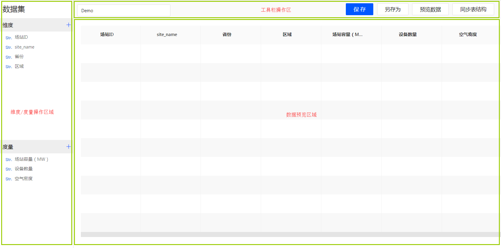
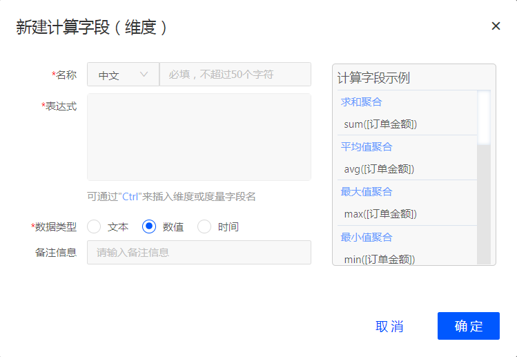
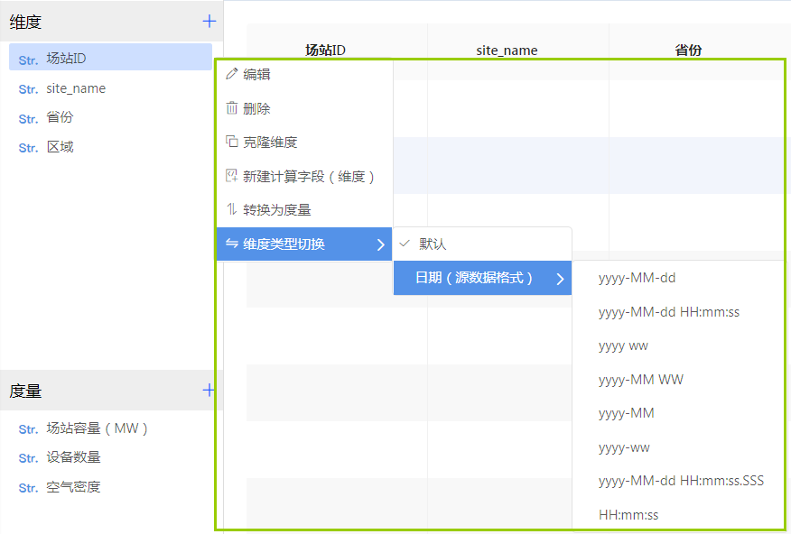
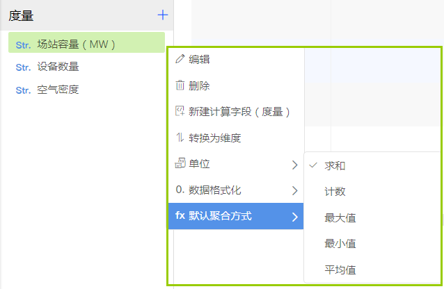

# 查询和管理数据集

登录EnOS 控制台，选择**BI & Report > 数据**，在**数据集**页签下可以看到你被授权访问的数据集信息。你可以对数据集进行编辑，重命名，复制，或删除操作。对于SQL模式创建的数据集，你可以修改SQL语句。

## 数据集

### 查询数据集

如下图所示，在**数据集**页签下的，你可以看到**我的**和**全部**两类数据集。

- 在**我的**数据集中，展示了你自己创建的，或你从**全部**数据集中复制的组织内其他用户创建的数据集。对于**我的**数据集，你可以进行**查看**，**重命名**，**复制**，和**删除**操作。

- 在**全部**数据集中，展示了你自己创建的，以及同组织内其他用户创建的全部数据集。对于组织内其他用户创建的数据集，你仅可以进行**查看**或**复制**的操作。

**注意**： 你不可以重命名和删除组织内其他用户创建的数据集，若要基于此类数据集进行修改和生产报表，你可以复制你需要的数据集并基于你的副本操作。

### 重命名数据集

数据集名称可以重复。支持输入中文、英文及特殊字符，且不超过50个字符。

数据集重命名有两种方式：

- 在数据集列表页面，点击数据集操作栏的(**重命名**按钮)，在弹出的对话框中输入新的数据集名称，并点击**确定**。
- 进入数据集编辑页面，在工具栏中输入新的数据集名称，并点击**保存**。

### 删除数据集

在数据集列表页面，点击数据集右侧的展开按钮",在展开的菜单中选择**删除**并点击**确定**。

**注意**：在已创建的报表中，若已关联了该数据集，将被同步删除。即配置该数据集的图表将显示数据为空。

### 复制数据集

在数据集列表页面，点击数据集右侧的展开按钮",在展开的菜单中选择**复制**并点击**确定**。系统将自动创建以**副本**为后缀的新数据集。

### 编辑数据集

在我的数据集列表中，选择需编辑的数据集，从**操作**栏点击(**编辑**按钮)，进入数据集编辑页面。

数据集编辑分为三个区域，分别是
- 维度/度量操作区域，数据集中所包含的字段分为**维度**和**度量**两个类型。你可以根据建表需要，编辑数据的维度字段或度量字段。
- 工具栏操作区，数据集编辑完成后，在工具栏中点击**保存，**另存为**或**重命名**已编辑好的数据集。
  - **预览数据**：点击**预览数据**，将在数据预览区域显示预览数据。
  - **同步表结构**： 此操作可以合并数据源表新增的表字段。当数据源表发生了改变，如新增了某字段，可以方便的将该新增字段同步。如果数据源表中的字段被删除，或发生变更，则不会同步。

    **注意**: 通过单表模式创建的数据集，支持同步表结构功能。通过SQL模式创建的数据集，不支持该功能。

- 数据预览区域。显示预览数据，最多展示20条记录。

#### 编辑维度

单击选中的维度字段，在弹出的菜单中，展示维度字段的相关操作。说明如下：

- **编辑**
  - 对于创建数据集时生成的原生字段，可以修改**名称**和**备注信息**。
  - 对于在编辑数据集时新建的维度字段，可以修改**名称**、**表达式**、**数据类型**，及**备注信息**。

  维度名称支持中英文输入。当浏览器为中文环境时，显示中文名称，当浏览器为英文环境时，显示英文名称。支持输入中文、英文及特殊字符，且不超过50个字符。

- **删除**

  点击删除，删除选中的维度字段。

  **注意**：若已创建的报表中，已配置了该字段，将被同步删除。

- **克隆维度**

  快速复制一个维度，生成的维度将会自动带上**副本**后缀以作提示。

- **新建计算字段（维度）**

  新建维度字段有两种方式
  - 点击维度栏标题右侧的**+**
  - 点击维度，在展开的菜单中选择**新建计算字段（维度）**。

  在表达式中输入自定义数值、字符或计算表达式的方式，来新建维度字段。当前支持包括求和聚合、平均值聚合在内的9种计算逻辑。

  

- **转换为度量**

  将当前维度将转化为度量。

- **维度类型切换**

  支持默认、日期类型的切换。可转换的日期格式如下图所示。

  

#### 编辑度量

单击选中的度量字段，在弹出的菜单中，展示度量字段的相关操作。说明如下：

- **编辑**
  - 对于创建数据集时生成的原生字段，可以修改**名称**或**备注信息**。
  - 对于在编辑数据集时新建的度量字段，可以修改**名称**、**表达式**、**数据类型**及**备注信息**。

  度量名称支持中英文输入。当浏览器为中文环境时，显示中文名称，当浏览器为英文环境时，显示英文名称。支持输入中文、英文及特殊字符，且不超过50个字符。

- **删除**

  点击删除，删除选中的度量字段。

  **注意**：若已创建的报表中，已配置了该字段，将被同步删除。

- **新建计算字段（度量）**

  新建度量字段有两种方式
  - 点击度量栏标题右侧的**+**
  - 点击度量，在展开的菜单中选择**新建计算字段（度量）**。

  在表达式中输入自定义数值、字符或计算表达式的方式，来新建度量字段。当前支持包括求和聚合、平均值聚合在内的9种计算逻辑。

- **转换为维度**

  将当前度量将转化为维度。

- **数据格式化**

  设置度量的数据格式。

- **默认聚合方式**

  在菜单中选择聚合方式，支持求和，计数，最大值，最小值以及平均值。

  

### 修改数据集SQL语句

对于通过SQL模式创建的数据集，可以修改SQL语句。

1. 在数据集列表页面，点击数据集右侧的展开按钮,在展开的菜单中选择**修改SQL**。
2. 在编辑区域内，编辑SQL查询语句，点击**语法检测**。
3. 若语法正确，点击**保存为数据集**，即完成数据集修改。

## 相关信息

- [创建数据集](creating_dataset)
