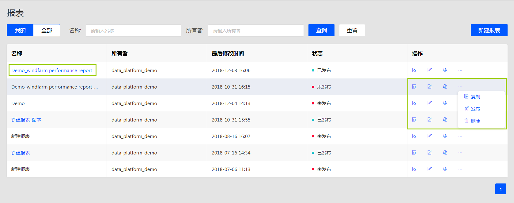
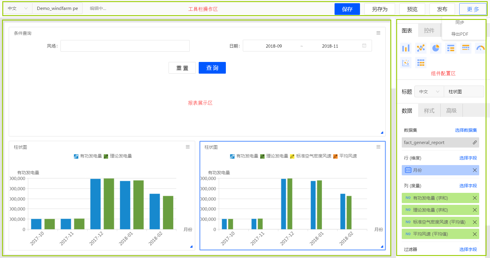
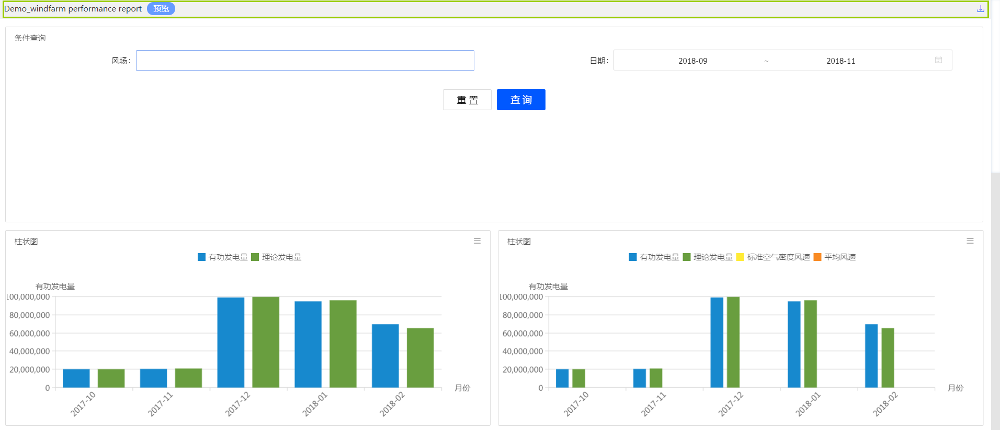

# 管理报表

从控制台左边导航菜单选择**BI & Report > 报表**。在报表列表中，可以对报表进行**预览**，**编辑**，**重命名**，**复制**，**发布/下线**，**删除**或**查看已发布报表**等操作。

## 查看已创建报表

按报表创建者身份，可以将报表分为**我的报表**和**全部报表**两类。

在**我的报表**中，展示了用户本人创建的报表。

在**全部报表**中，展示了包括用户本人创建的，以及同组织内其他用户创建且已发布为**组织内公开**的报表。其中，对于组织内其他用户发布的**组织内公开**报表，可以进行**查看已发布报表**的操作。

## 报表编辑页面

登录**控制台**，选择**BI & Report**，然后选择**报表**。在报表列表页面中，选择一个报表，点击右侧的**编辑**按钮，进入报表编辑页面。

报表编辑页面分为三个区域，分别是**组件配置区**，**报表展示区**以及**工具栏操作区**。

**组件配置区**

在组件配置区，可以根据业务需要，选择相应的图表或控件，通过鼠标左键**双击**来添加图表或控件。还可以编辑组件的显示标题，并完成过滤、多图关联等各种配置。

BI & Report提供丰富的图表组件，包括柱图、线图、饼图、交叉表、指标块、仪表盘、散点图及突出显示表，可以满足丰富的数据可视化需求。添加图表组件后，可以在**数据**中选择数据集，配置维度或度量字段来完成数据配置。还可以在**样式**中设置不同的图表展示效果。对于支持多图关联的图表，可以在**"高级"**中，配置与其他图表的关联关系，实现多图联动查询的效果。

同时，还提供了包括文本框、iFrame、查询条件及图片在内的4种控件，可以满足基本的数据分析及查询的需求。

详细的图表或控件的使用说明，请参考**报表图表制作**。

**报表展示区**

在报表展示区，可以通过选中并拖拽组件标题栏的方式，调整图表或控件的位置。选中并拖拽组件右下角的,来调整组件的大小。

同时，还可以方便的切换组件的类型。在画布中选中某个组件后，在组件配置区中，**单击**某个不同类型的图表或控件。已选中组件将自动被替换为新的图表或控件。

点击报表展示区的空白区域，还可以完成是否**显示分页线**的全局设置。

**工具栏操作区**

在**工具栏操作区**，可以进行**保存**、**另存为**、**预览**、**发布**、**重命名**、**恢复为已发布版本**及**导出PDF**等操作。

其中，报表名称支持中英文输入。当浏览器为中文环境时，显示中文名称，当浏览器为英文环境时，显示英文名称。报表名称支持输入中文、英文及特殊字符，且不超过50个字符。

## 预览报表

报表发布之前，一般需要预览一下报表的显示效果。在预览之前，需要先点击**保存**，然后点击**预览**，就可以查看报表的显示效果。同时，还可以将当前报表下载为PDF文件到本地。

预览报表有两种途径：

- 报表列表页面，选择一个报表，点击右侧的**预览**按钮
- 报表编辑页面，点击右上角的**预览**按钮

## 发布/下线报表

**发布报表**

报表编辑完成后，可以将当前报表发布为**仅所有者可见**或**组织内公开**。发布成功后，用户将获取一个URL地址。在浏览器中输入该URL地址，并输入用户名及登录密码。验证成功后，就可以在线查看报表内容，而不需要登录EnOS控制台，进入BI & Report中查看报表。

当选择**仅所有者可见**时，仅允许创建该报表的用户在线查看。当选择**组织内公开**时，允许同组织内所有用户查看该报表。

对于已发布的报表，可以在报表列表中直接点击该报表的名称，在线查看报表。另外，对于发布为**组织内公开**的报表，可以在**报表列表->全部**中查看。

发布报表有两种途径：

- 报表列表页面，选择一个报表，点击右侧的****按钮，在展开菜单中，点击**发布**并**确定**
- 报表编辑页面，点击右上角的**发布**按钮并**确认**

**下线报表**

对于已发布的报表，可以对其进行**下线**操作。下线成功后，发布时获取的URL地址将自动失效。

下线报表的途径是：

报表列表页面，选择一个已发布的报表，点击右侧的****按钮。在展开菜单中，点击**下线**并**确认**。此时，URL地址已失效。在浏览器中输入URL地址时，将显示**请注意，该链接已失效！**

## 恢复为已发布版本

为了避免编辑报表时，对已发布的报表造成影响。每一个已发布的报表，都会存储两个版本的配置，分别是：

- 编辑态版本，即在报表编辑页面中，编辑并保存，但尚未发布的版本；
- 发布态版本，即保存后且已发布的版本。

使用该功能的常见场景：

对于一个已发布的报表，在报表编辑页面进行二次编辑。若对于编辑的效果不满意，需要回滚为已发布报表的配置。此时，可以点击**更多->恢复为已发布版本**并**确认**。则发布态版本的配置将替换编辑态版本的配置。然后，可以再次进行编辑。

## 导出PDF及显示分页线

**导出PDF**

报表编辑完成后，可以将报表导出为PDF文件到本地，且默认存储到浏览器下载目录。

导出PDF有三种途径：

- 报表编辑页面，点击**更多->导出PDF**并**确定**；
- 报表预览状态下，点击右上角的;
- 查看已发布报表状态下，点击右上角的。

**显示分页线**

导出PDF时，会将报表内容自动分页。如果内容超出一页，可能将同一个组件切分为两部分。为了保证导出文件的效果，BI & Report提供了**显示分页线**的全局设置。

点击画布中的空白位置，组件配置区将出现全局设置。勾选**显示分页线**，画布中会按照分页位置，显示一条虚线。您可以按照虚线位置调整图表或控件的大小。导出PDF时，报表将按照分页线的位置，划分为不同的页面。

## 查看已发布报表

登录**控制台**，选择**BI & Report**，然后选择**报表**。

在报表列表页面，点击已发布报表的**报表名称**，可以查看报表效果。

在**全部报表**中，展示了同组织内其他用户创建且已发布为**组织内公开**的报表。此时，点击**报表名称**可以查看已发布报表的内容。

## 重命名报表

登录**控制台**，选择**BI & Report**，然后选择**报表**。

报表重命名有两种方式：

- 在报表列表页面，点击报表右侧的**重命名**，在弹出的对话框中输入新的报表名称并**确定**。
- 进入报表编辑页面，在工具栏中输入新的报表名称。

报表名称可以重复。支持输入中文、英文及特殊字符，且不超过50个字符。

## 复制报表

登录**控制台**，选择**BI & Report**，然后选择**报表**。

在报表列表页面，点击报表右侧的展开按钮**",在展开的菜单中选择**复制**。系统将自动创建所选报表的副本，且带上**_副本**以作提示。

## 删除报表

登录**控制台**，选择**BI & Report**，然后选择**报表**。

在报表列表页面，点击报表右侧的展开按钮**",在展开的菜单中选择**删除**并**确定**。

## 相关信息

- [创建报表](creating_report)
