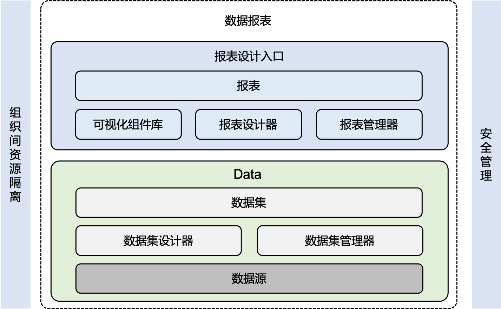

# 系统架构

BI & Report产品架构图如下图所示。

BI & Report主要模块及功能:

## 数据处理模块<processing>

- 数据源

  EnOS平台为每个开通BI & Report模块的组织，默认自动创建一个Report DB数据库。Report DB的特点是实时查询效率高，可以很好的满足数据分析的需求。您可以使用数据集成工具，将平台内Hive数据同步至Report DB，完成数据的准备。

- 数据集设计器

  支持灵活的数据集编辑功能，包括对维度值或度量值进行新建、编辑、复制、删除、转换等操作。同时，还可以设置度量的默认聚合方式，包括求和、计数、最大值、最小值及平均值等。它在报表设计环节可直接被引用，用户无需再关心报表设计以外的底层数据表逻辑处理。

- 数据集管理器

  支持数据集的生命周期管理，包括创建、删除、复制、编辑等操作。连接数据源后，可以在一张或多张数据源表的基础上，通过单表创建，或多表SQL语句的方式，创建数据集。

## 数据可视化模块<visualization>

- 报表设计器

  报表设计器采用灵活的磁贴式布局来显示报表数据的交互，可通过所见即所得的方式完成各类报表页面的制作。不仅支持多种方式的数据过滤和查询，还提供了丰富的图表及控件来实现数据可视化。同时还可以将报表导出成PDF文件到本地。

- 报表管理器

  支持报表的生命周期管理，包括创建、删除、复制、编辑等操作。同时，还可以发布已创建的报表，包括面向组织内公开，或者仅所有者可见。

- 可视化组件库

  BI & Report提供丰富的图表或控件组件，满足大多数场景下的数据可视化及分析的需求。提供包括柱状图、折线图、饼状图、交叉表、散点图、指标块、仪表盘、散点图及突出显示表等图表。同时还提供包括查询、IFrame、文本框、图片等控件。

## 安全管理模块<securitymanagement>

- 数据安全

  EnOS平台为每个开通BI & Report模块的组织，默认分配一个Report DB数据库，以实现组织间的资源隔离。另外，产品与平台账号及权限系统打通，当查看已发布报表时，需要登录验证通过后，才可以查看。
