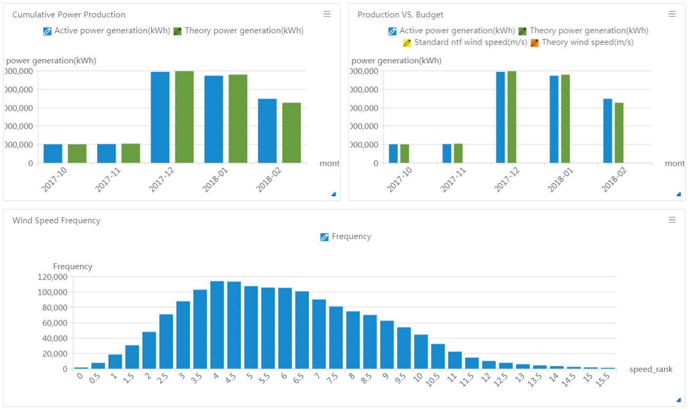

# BI & Report概述

BI & Report服务是远景EnOSTM IoT平台提供的帮助进行数据分析与可视化的轻量级商业智能分析产品。BI & Report服务主要面向数据分析人员，为用户提供从连接数据源，创建数据集，到以灵活拖拽的方式制作可视化报表的服务。产品有效地降低了用户分析数据的门槛，并支持快速制作自定义报表。

BI & Report服务主要有以下优势：

- **实时高效**：无缝集成EnOS云端数据库，提供的Report DB实时查询效率高，极大地提高了数据分析效率；
- **组件丰富**：提供丰富的数据可视化图表及控件，满足不同业务场景的可视化需求；
- **操作便捷**：创建数据集的方式，降低数据获取和使用门槛，减少了数据准备的复杂度；
- **安全性高**：基于平台完善的安全体系，对数据安全进行控制。

通过EnOS BI & Report服务创建报表的核心流程为：
1. 连接_数据源_
2. 创建_数据集_
3. 制作_报表_

BI & Report服务相关概念的描述，参见[概念](report_concepts).

下图为可视化报表的样例，你可以参考[快速入门](gettingstarted_report)，来制作自己的第一张报表。

