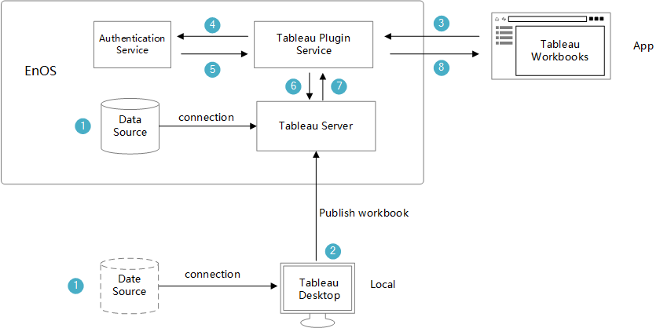

# Tableau server overview
As the leading product in the business intelligence software industry, Tableau aims to help users better view and understand data.

As a seamless integration of data analysis products with EnOS™, Tableau Server not only reinforces the capacity of EnOS™ in displaying and analyzing data but also  provides an integrated framework for rapid integration of Tableau worksheets.

## Why Tableau Server services on EnOS™?
The Tableau Server service on EnOS™ simplifies the complexity of the business application integration of Tableau worksheets and safeguard the security of customer data.

**Agile**  
- Host: Tableau Server is hosted on EnOS™, customers who use Tableau Server service no longer need to maintain their own Tableau Server.
- Encapsulation: EnOS™ encapsulates the original interface provided by Tableau Server, enabling developers to integrate Tableau worksheets into business applications more efficiently.

**Secure**  
- Single sign on:After logging into the EnOS™ account, the developer can use the Tableau Server service to get the authorized Tableau worksheet URL. EnOS™'s security scheme isolates external applications and Tableau Server to protect customers' data.

## Key concepts
Before using EnOS™'s Tableau Server service, you need to understand the following concepts:

### Tableau Desktop
Tableau Desktop is client for worksheet development.

### Tableau Server
Tableau Server is used to share and collaborate worksheets that data analyst developed with Tableau Desktop.

### Tableau site
In Tableau-speak, a site mean a collection of users, groups, and content (workbooks, data sources) that’s walled off from any other groups and content on the same instance of Tableau Server. Another way to say this is that Tableau Server supports multi-tenancy by allowing server administrators to create sites on the server for multiple sets of users and content.

### Tableau workbook and worksheet
Tableau uses a workbook and sheet file structure, much like Microsoft Excel. A workbook contains sheets. A sheet can be a worksheet, a dashboard, or a story.

You can visit the [Tableau website](http://www.tableau.com/) for more detailed information.

## Key personas

- **Customer**: The owner of data in EnOS™ is usually the purchaser of Tableau Server service.
- **Application** Developer: Application developers under the customer organization who have the permissions of application management.
- **Data Analyst**: The data analyst under the customer organization has the permission to deal with the data of customers in EnOS™.

## How does the Tableau Server service work?
The following picture describes how Tableau Serve services on EnOS™ collaborate with business applications, data sources, Tableau Desktop and Tableau Server:

1. Data analysts prepare data sources.
2. Data analysts connect data sources, develop worksheets, and publish them to Tableau Server on EnOS™. Please refer to [how to connect data sources](https://www.tableau.com/learn).
3. Customer visits the business application embedded Tableau worksheets, the application will send a request to Tableau Server service.
4. The Tableau Server service carries the necessary information sent by the application to get the application authenticated in EnOS™ authentication service.
5. The EnOS™ authentication service returns the authentication result.
6. Tableau Server service completes application certification in the backend, then ask for Tableau Server's URL.
7. Tableau Server returns the available Tableau URL to the Tableau Server service.
8. Tableau Server service returns the available Tableau URL to the application, the worksheet is displayed in the application.

## Related Information
- [Using the Tableau Server service](using_tableau_server)
